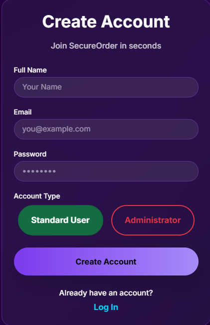
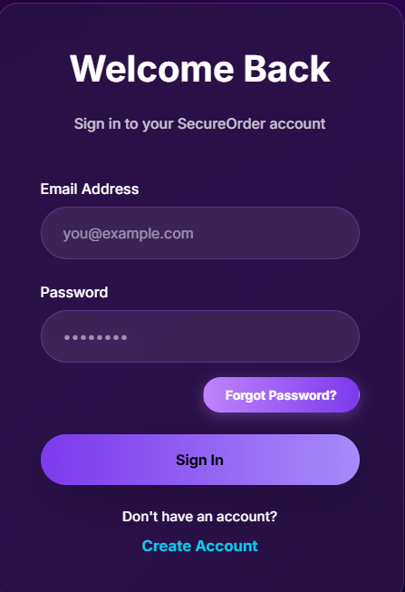
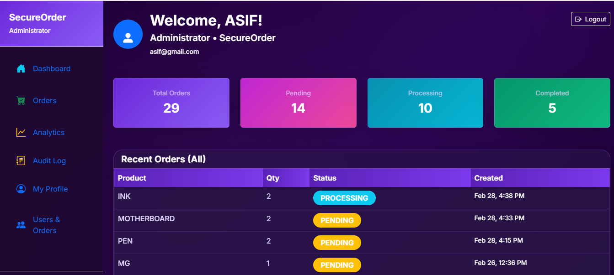
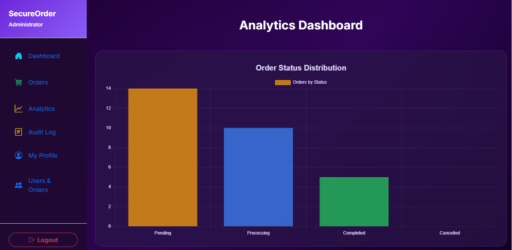
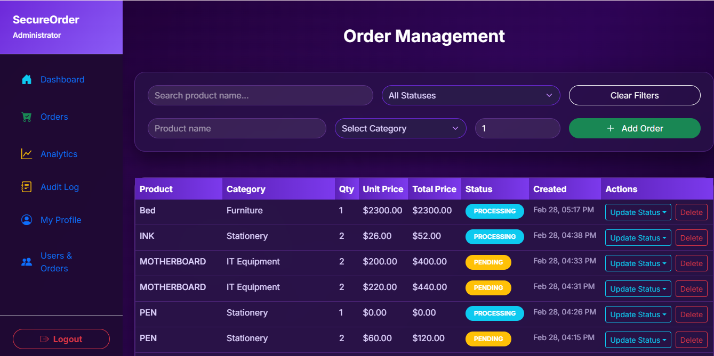
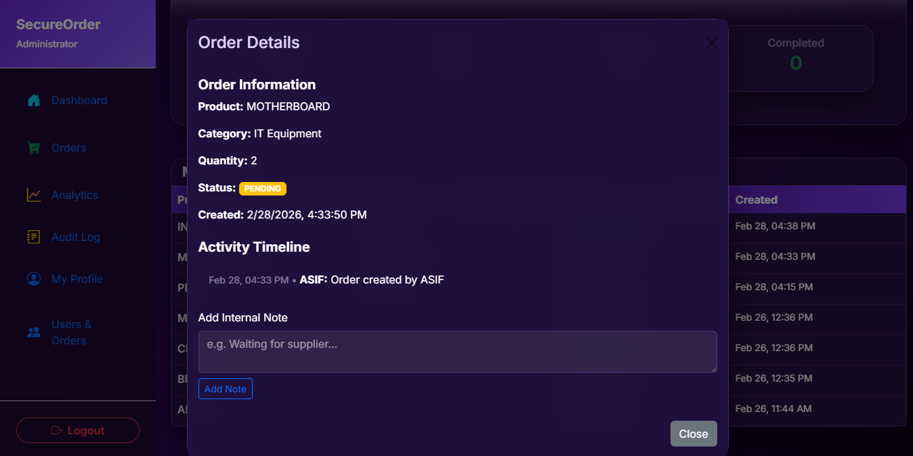
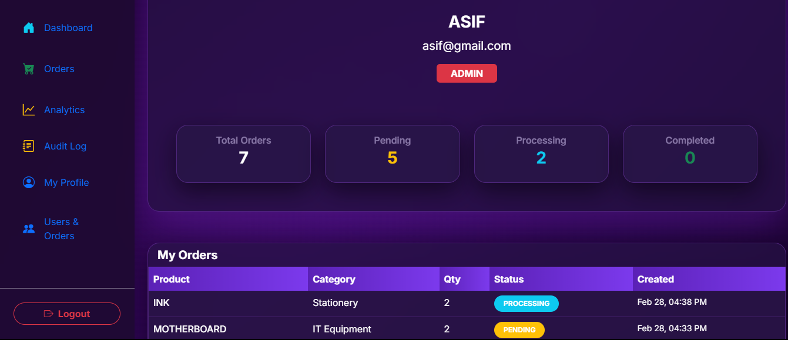
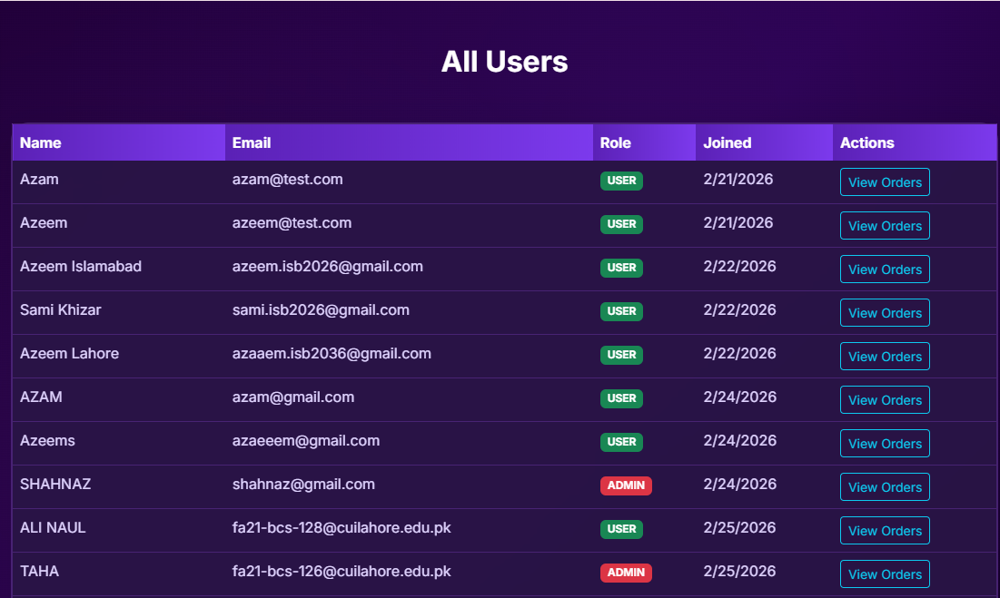
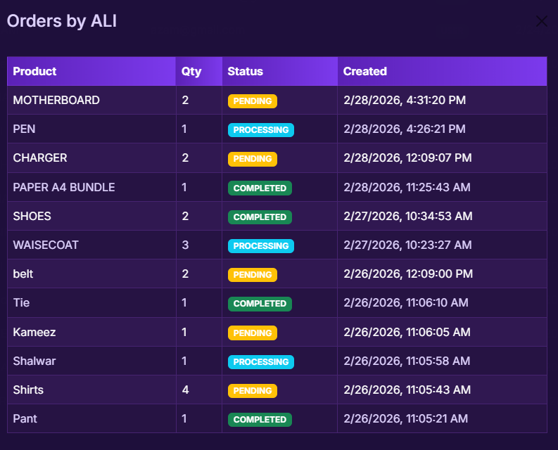

# SecureOrder – Order Management System

Full-stack **MERN** procurement and order tracking application with secure JWT authentication, role-based access control (User / Admin), real-time updates via Socket.io, audit logging, analytics dashboard, and user management.

## Screenshots
<div align="center">
<br>
  <em>Signup / Register Page</em>

  <br>
  <em>Login Page</em>

  <br>
  <em>Forgot Password Page</em>
  </div>
### Dashboard (Admin View)


### Analytics Dashboard (Chart)


### Order Management Page


### Order Details


### Profile (User View with Stats)


### Audit Log (Detailed Actions)


### Users List (Admin)


### User Orders


## Features

### Authentication & Security
- Register / Login with JWT access + refresh tokens
- Forgot Password + Reset via email link (Nodemailer)
- Role-based access control (RBAC): Standard User vs Administrator
- Protected routes & Axios interceptors for token refresh

### Order Management
- Create orders (product, category, quantity)
- View own orders (users) / all orders (admins)
- Update status (Pending → Processing → Completed / Cancelled)
- Delete orders (own pending for users, any for admins)
- Admin sets unit price → total price auto-calculates
- Real-time updates using Socket.io (live create/update/delete)

### Admin Tools
- Global stats cards (Total, Pending, Processing, Completed) with colorful gradients
- Analytics dashboard – bar chart of order status distribution (Chart.js)
- Full audit log – tracks every action (who, what, when, details)
- All users list with roles and quick actions (view orders)

### User Experience
- Beautiful dark theme with glassmorphism cards & gradients
- Responsive design (mobile + desktop)
- Toast notifications, loading spinners, confirmation dialogs
- My Profile page with personal order stats

## Tech Stack

**Frontend**  
- React 18 (Create React App)  
- React Router v6  
- Bootstrap 5 + custom dark theme  
- Axios + interceptors  
- Socket.io-client  
- Chart.js + react-chartjs-2  
- SweetAlert2 (logout confirmation)

**Backend**  
- Node.js + Express  
- MongoDB (Atlas) + Mongoose  
- JWT (access + refresh tokens)  
- bcryptjs (password hashing)  
- Socket.io (real-time)  
- Nodemailer (password reset emails)  
- Crypto (secure tokens)

## Local Setup

### Backend
```bash
cd src
npm install
# Create .env with MONGO_URI, JWT_SECRET, EMAIL_USER, EMAIL_PASS, etc.
node server.js
# or npm run dev (if nodemon installed)

###Frontend
cd frontend
npm install
npm start